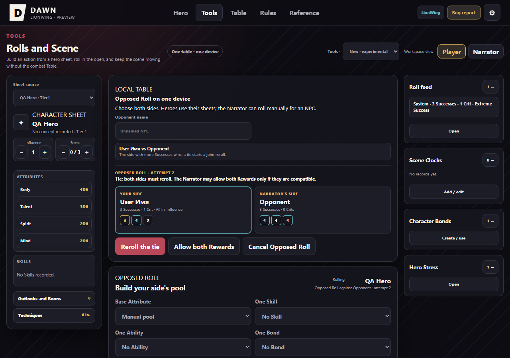
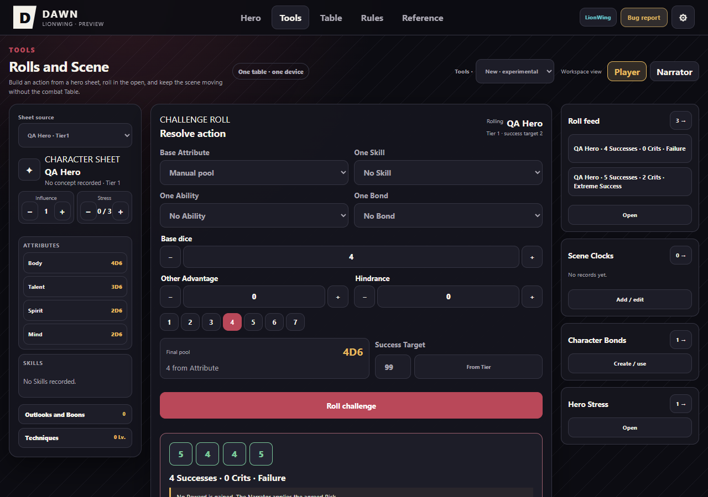

# Вычитка интерфейса RU/EN — предложения на проверку · 07.10.2026

Статус: первоначальные предложения сохранены ниже; часть уже применена по последующему поручению пользователя. Актуальная приёмка — в таблице ниже. Короткий проход по Инструментам и Столу: ниже все находки этого прохода. Это не обещание полной проверки всех ветвей приложения. Динамические строки подтверждены чтением исходников; не каждая соответствующая игровая ситуация отдельно воспроизведена в браузере.

**Сохраняем:** D6, 4D6 и прочие обозначения, формулы, числа, DAWN, LionWing, имена персонажей, пользовательские названия/теги и идентификаторы. Исходный EN в раскрываемых цитатах и ссылках на источник сохраняется как источник. Переводим подписи интерфейса, а не содержимое пользовательских записей. Названия Даров требуют сверки с каноническим каталогом перед применением.

## Актуальный статус после продолжения

| Блок первоначальной вычитки | Статус |
|---|---|
| НПС в RU | Применено, включая подсказку Javelin и профили |
| Пул, источники, переключатели Даров EN | Применено; Plenty To Learn/Outgunned/Dark Urge и доступные имена сверены с локальным каталогом |
| Карточки Связей EN | Применено; предлагаемые стандартные теги имеют EN подписи, старые значения/записанные теги неизменны |
| Редактор часов EN | Применено предыдущим малым пакетом |
| Стресс EN | Применено предыдущим малым пакетом |
| История после смены языка | Известные стандартные итоги переводятся только при отображении; произвольный итог сохраняется |
| Встречное испытание/итоги EN | Применено целиком, включая роль, ничью/переброс, оплату, число Успехов/Критов и кнопки |
| Справка Связей EN | Заголовки применены; legacy тела из D.bonds — отдельные данные, этим пакетом не переписаны |
| Пустое поле EN | Применено, права и suppress во время выбора клетки сохранены |
| Профили/части босса EN | Применено; IDs, team и выбранные части сохранены |

Новые аналогичные утечки также исправлены: экран обычного броска (Награда,
Риск, Ва-банк, исходные кости), панель запроса, системные fallback имени/Ступени,
доступные имена кнопок редакции и настроек. Исходные outcome/payment в истории
и команды оплаты не меняются вместе с языком.

Проверки продолжения: полный `npm --prefix apps/companion test`, exit 0;
новый `freeplay-localization.mjs` включён в freeplay-tools (RU→EN→RU,
неизменность истории/имён/значений тегов, роли, pending/tie/winner).
Реальный локальный browser: ничья EN, смена EN→RU→EN без изменения JSON,
обычный успех и провал через кнопку; формула 4D6 ≥4 и RU outcome в сохранении.
Supabase блокировался до загрузки страницы; общий стол не подключался.

## Остаток и отдельные находки

- Полной проверки всех динамических экранов/диалогов и всех редких workflow
  приложения пока нет. Не объявлять полностью чистую локализацию.
- Встроенная лицензионная строка остаётся двуязычной; исходные цитаты и
  пользовательские имена/названия/теги остаются на исходном языке.
- D.bonds всё ещё общий legacy набор RU 0.9. В LionWing offered tags приходят
  оттуда; перевод подписи не является миграцией правил или сохранений.
  Переключать сами значения тегов нельзя: это влияет на standard/custom bonus.
- Обнаруженная потеря метаданных истории при reload исправлена следующим
  пакетом: автор, формула, кубики, пороги, отметка состязания и оплата сохраняются.
  Проверены реальный бросок/перезагрузка и экспорт/импорт; уже потерянные
  в старых сохранениях данные восстановить невозможно.
- Текст альтернативных Рисков в resolveDice наследован из прежнего интерфейса:
  перевод не заменяет отдельную сверку состава правил с LionWing canonical.

## Английские обозначения НПС в русском интерфейсе

| Где | Сейчас | Предложение RU |
|---|---|---|
| `play-ui.js`, выбор противника | Другой NPC… | Другой НПС… |
| `play-ui.js`, подсказки Нарратора | за NPC Нарратор может бросить вручную / за NPC можно бросить с пульта | за НПС… |
| `play-ui.js`, справка по Связям | Нарратору: связанные NPC должны возвращаться | Нарратору: связанные НПС должны возвращаться |
| `play-ui.js`, тип записи справочника | NPC · роль | НПС · роль |
| `play-ui.js`, фильтр справочника | NPC | НПС; внутреннее значение фильтра NPC оставить |
| `scene-ui.js`, профили | NPC LionWing | НПС LionWing |
| `scene-ui.js`, пояснение Javelin | на самом NPC | на самом НПС |
| `locale-ru.js`, `tools.unnamedNpc` | Безымянный NPC | Безымянный НПС |
| `index.html`, запасной placeholder | Безымянный NPC | Безымянный НПС |

## Русские подписи расчёта пула в английской версии

Файл: `play-ui.js`, `freeplayBondStatus`, `toolsDiceRequest`, `renderDiceComposer`.

| Сейчас | Предложение EN |
|---|---|
| Ранг N | Rank N |
| нестандартный тег +1 | custom tag +1 |
| Сторожевой пес +2 | Guard Dog +2 |
| Взгляд учителя +2 | Perspective of a Teacher +2 |
| Взгляд друга: Ранг +1 | Perspective of a Friend: Rank +1 |
| Глухота к сверхъестественному ×2 | Supernatural Deafness ×2 |
| Навык: … | Skill: … |
| Способность: … | Ability: … |
| без названия | unnamed |
| Связь: … (Ранг N) | Bond: … (Rank N) |
| В меньшинстве · условие подтверждено | Outgunned · condition confirmed |
| В меньшинстве · +2 Преимущества, если это верно в текущем повествовании | Outgunned · +2 Advantage when the condition holds in the current narrative |
| Тёмный порыв · +4 Преимущества со Способностью; нечётные Успехи дают Нарратору право сменить цель | Dark Urge · +4 Advantage with an Ability; odd Successes allow the Narrator to change the target |
| Ещё многому учиться / флэшбек +4 | Название из EN-каталога Дара / flashback +4; имя Дара здесь не утверждено |
| Недостаточно Влияния | Not enough Influence |
| Стресс уже максимален | Stress is already at maximum |

`allIn`: русское внутреннее значение оплаты «Влияние» участвует в сравнении. Не заменять его без разделения данных и отображения.

## Карточки Связей в EN

Файл: `play-ui.js`, `renderFreeplayBonds`.

| Сейчас | Предложение EN |
|---|---|
| Быстрая Связь | Quick Bond |
| В пул: +ND6 | To pool: +ND6 — D6 сохраняется |
| Ранг N | Rank N |
| Повысить Ранг | Raise Rank |
| Для повышения нужны все теги текущего Ранга | Fill the current Rank’s tags before raising it |
| Тегов пока нет | No tags yet |
| Все места тегов заняты | All tag slots filled |
| Добавить тег… | Add a tag… |
| Свой тег… | Custom tag… |
| В бросок | Use in roll |
| Удалить | Remove |
| Связей пока нет. В обычной или быстрой Связи можно хранить Ранг и неизменяемые теги. | No Bonds yet. Regular and Quick Bonds store a Rank and fixed tags. |

## Редактирование часов в EN

Файл: `play-ui.js`, `renderClocks`. Заголовки групп уже двуязычные, поля редактора — нет.

| Сейчас | Предложение EN |
|---|---|
| Название | Name |
| Сохранить | Save |
| Сбросить | Reset |
| Удалить | Remove |
| Тип | Type |
| Хорошие / Плохие | Good / Bad |
| Текущее | Current |
| Максимум | Maximum |
| N из M — доступное имя сегмента | N of M |
| название: заполнено N из M — доступное имя часов | name: filled N of M |

## Стресс в EN

Файл: `play-ui.js`, `toolsStressOwners`, `setToolsStressTracker`, `renderStressTrackers`.

| Сейчас | Предложение EN |
|---|---|
| Безымянный герой — только программная заглушка | Unnamed hero |
| Стресс — подпись изменения и сегментов | Stress |
| Максимум · герой вне строя | Maximum · hero out of action |
| Стресс N из M | Stress N of M |
| Добавьте героев за общий стол. | Add heroes to the shared table. |
| Нет текущего героя. | No current hero. |

## История бросков после смены языка

`renderDiceHistory`: готовый результат сохраняет язык, на котором был сделан бросок. Предложение: переводить только отображение распознаваемого программного результата, не переписывать журнал и произвольные тексты.

| RU | EN |
|---|---|
| Провал | Failure |
| Минимальный успех | Minimal Success |
| Крайний успех | Extreme Success |
| Ничья | Tie |

## Встречное испытание и итоги в EN

`opposedResultSummary` действительно вызывается английской панелью Нарратора. `challengeResultSummary` и `renderOpposedStatus` также содержат русские подписи.

| Сейчас | Предложение EN |
|---|---|
| Ничья: Нарратор разрешил обе совместимые Награды. | Tie: the Narrator allowed both compatible Rewards. |
| Побеждает {name} и получает свою Награду. | {name} wins and gains their Reward. |
| Ничья: стороны должны перебросить. Нарратор может разрешить обе Награды, только если они не исключают друг друга. | Tie: both sides must reroll. The Narrator may allow both Rewards only if they are compatible. |
| Получен N из 2 результатов. | N of 2 results received. |
| Обе стороны собирают свои пулы и бросают. | Both sides build their pools and roll. |
| Успех / Успеха / Успехов | Success / Successes по числу |
| Крит / Крита / Критов | Crit / Crits по числу |
| Ва-банк | All In |
| ВАША СТОРОНА | YOUR SIDE |
| СТОРОНА НАРРАТОРА | NARRATOR’S SIDE |
| УЧАСТНИК | PARTICIPANT |

Остальные составные фразы `renderOpposedStatus` нужно включить в тот же перевод целиком, а не смешивать перевод заголовка с русским итогом.

## Заголовки справки о Связях в EN

`play-ui.js`, `renderBondReference`. Тела правил берутся из данных; язык тел отдельно проверить в браузере.

| Сейчас | Предложение EN |
|---|---|
| Теги и пределы | Tags and limits |
| Быстрые Связи | Quick Bonds |
| Повышение Ранга | Raising Rank |
| Цена и первое действие | Cost and first action |
| 10 стандартных действий и тегов | 10 standard actions and tags |
| Антагонистические действия | Antagonistic actions |
| Связи в других базовых правилах | Bonds in other core rules |
| Базовое правило | Core rule |
| Особенности, которые меняют правила Связей | Features that change Bond rules |
| Здесь собраны Дары и Техники… | Boons and Techniques from other chapters that create, improve, limit, or alter Bonds. |
| Нарратору: связанные NPC должны возвращаться | Narrator: NPCs with Bonds should return. |

## Пустое поле Стола в EN

`scene-ui.js`, `renderSceneBoard`.

| Сейчас | Предложение EN |
|---|---|
| Участники вне поля | Participants off the field |
| Сцена ждёт героев | The Scene is waiting for participants |
| Участники уже добавлены, но сейчас вне поля. Проверьте их состояние в Пульте. | Participants are already added but are currently off the field. Check their state in the cockpit. |
| Исчезнувшие могут появиться в начале своего Хода: начните Ход и выберите клетку появления. | Disappeared characters can reappear at the start of their Turn: start the Turn and choose an arrival space. |
| Добавьте героя или противника — они сразу появятся на поле. | Add a hero or opponent to the field. |
| Нарратор ещё не добавил участников. | The Narrator has not added participants yet. |
| Открыть Пульт | Open cockpit |
| Добавить участника | Add participant |

## Профили и части босса в EN

`scene-ui.js`, `renderEnemySelect`, `updateCompoundBuilderSelection`, `renderCompoundBuilder`.

| Сейчас | Предложение EN |
|---|---|
| Модификаторы LionWing | LionWing Modifiers |
| Именные | Named |
| Обычные враги | Common enemies |
| Враги-Модификаторы | Enemy Modifiers |
| Без Черты Антагониста | No Antagonist Trait |
| Выбрано N: нужно минимум две части. | N selected: at least two Parts are required. |
| Нельзя объединить союзников и противников в одного босса. | Allies and opponents cannot be combined into one boss. |
| Готово к объединению: N части. | Ready to combine: N Parts. |
| Части босса | Boss Parts |
| Союзник героев | Hero ally |
| Противник | Opponent |
| Ступень N | Tier N |
| Выставьте минимум два отдельных профильных НПС. | Deploy at least two separate NPC profiles. |

## Граница применения

Предыдущий локальный патч вычитки сохранён вне Git как `output/locale-copy-review-2026-10-07/LOCAL_DRAFT.patch`; рабочие файлы перед продолжением свежей ветки восстановлены. Он частичный, не готов к применению поверх нового интерфейса. Этот документ — полная передача всех находок короткого прохода, а не скрытое разрешение на массовую замену.

Новые подписи текущей переработки («Окружение», локальная линейка, безопасный ластик) сразу имеют RU/EN варианты. Это не считается принятием всех предложений выше.

## Применён малый пакет после согласования пользователя

07.10.2026: в русских Инструментах изменены «Другой NPC», placeholder
«Безымянный NPC», две подсказки Нарратора, видимый фильтр и тип карточки
справочника на НПС. Внутренний ключ фильтра `NPC` сохранён; фильтрация и
сохранённые ссылки не зависят от новой подписи.

В EN переведены fallback имени героя у Стресса, подписи изменения/сегментов,
максимальное состояние и два пустых состояния. Сообщения о недостатке Влияния
и максимальном Стрессе переключаются вместе с языком. В выборе произвольного
противника EN отображает Other NPC….

Остальные строки таблиц остаются предложениями. Часы, составные итоги,
справка о Связях и названия Даров этим малым пакетом не изменялись.
D6 и формулы сохранены. Проверены syntax, localization architecture,
freeplay-tools, freeplay-resources-gadgets; браузер отдельно не запускался.

Вторая малая порция: переведены EN подписи редактора часов Name/Save/Reset/Remove/Type/Good/Bad/Current/Maximum и доступные имена сегментов/заполнения. Имена часов и формулы не изменены. Syntax/localization/freeplay-tools PASS; реальные функции renderClocks выполнены в VM для editable/read-only RU/EN. Браузер не запускался.
