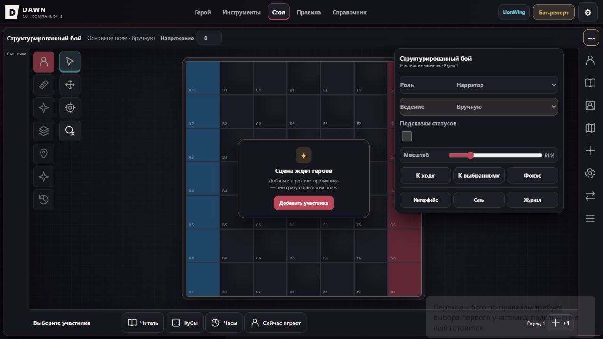

# Независимая проверка стола «По правилам» · 09.10.2026

**Готовность автоматического стола не подтверждена: UI-проход BLOCKED на создании новой rules-сцены.** Ни manual-проверки, ни harness не засчитаны как rules UI PASS.

## База и изоляция

Получен `git fetch origin`. Прочитаны запрос `2a3bde19880e465c51be3147352262fcd1207895:docs/tasks/TABLE_QA_FIX_REQUEST_2026-10-09.md`, полный исторический отчет, CODEX, архитектура, локализация, документы автоматизации и договор TABLE_TOOLS_PLAN. База кода — `origin/main`, `6dd57c188be8b95ffac48a6d56f42e3e45d8f5ad`; отдельные checkout `Dawn-rules-qa` и ветка `codex/rules-table-qa-20261009`.

Исходный checkout и ветка manual-исправлений не изменены. Supabase, кампании, сервер и SQL002 не использовались. Продуктовых исправлений в этом diff нет: подтвержденный блокер является отсутствующим запуском нового боя, а не одним из шести manual-дефектов.

## Реальный браузер

Использован обычный `index.html` из рабочей копии, IAB, `http://127.0.0.1:8879/index.html?lang=ru&edition=lionwing&mode=play`. Не было инъекций store/localStorage, импорта rules snapshot, подмены runtime, сокрытия элементов или механических команд из консоли.

Первый просмотр порта 8765 обнаружил ранее сохраненную локальную rules-сцену с именованными героями и врагами. Она только наблюдалась; никаких действий по ее изменению не выполнено. Проверка перенесена на другой origin 8879, где обычная страница показала пустое поле, «Сцена ждёт героев», Раунд 1, Напряжение 0 и «Вручную».

Через меню «Настройки вида и Сцены» выбран «По правилам» штатным selectOption. DOM после действия: выбранное значение снова «Вручную»; status: **«Переход к бою по правилам требует выбора первого участника; подключение ещё готовится.»** Повтор того же действия для фиксации screenshot дал тот же отказ. Это не confirm/инструментальный timeout.

Снимок фиксирует состояние страницы после попытки. Точный текст status подтвержден DOM; исчезновение toast или задержка paint снимка не заменяют DOM-доказательство.

## Причина и граница исправления

- `app-core.js:blankScene` создает `tablePolicy.mode="manual"` для нового стола.
- `app-scene-events.js` обрабатывает manual→rules ранним toast и render без отправки команды запуска.
- `scene-table-policy.js` отклоняет прямой policy→rules с `TABLE_START_RULES_REQUIRED`, а `kind:"start-rules"` безусловно с `TABLE_START_RULES_UNAVAILABLE`.
- Существующие rules-сцены проходят старый диспетчер; это совместимость сохранений, а не поддерживаемый способ создать независимую QA-сцену.

Поэтому наличие участников не устранит отказ: обработчик не проверяет их и не предлагает выбрать первого. Импорт сохраненного боя или переключение frozen runtime обошли бы требуемую границу. Инициализатор требует реализации уже описанного договора TABLE_TOOLS_PLAN: preview/отмена, первый участник, Round 1/Tension 0, стартовый Focus/ОД с каноническими исключениями, сохранение карты/позиций/ЗД/Ран/Стресса/Влияния/пометок, явная судьба старых сроков без догоняющих событий и pending-work guard. История/receipts, ownership и сетевые намерения требуют проверок на той же атомарной границе. Он не реализован в этом аудите путем снятия guard.

## Применимость находок к rules: ревью, не UI-приёмка

| Находка | Вывод по коду | Новая rules UI-проверка |
|---|---|---|
| F1 | Поврежденный footer принадлежит manual workspace и скрыт вне manual. Общий HUD имеет text input и healthChange с относительным вводом; rules пишет через lwSubmit. Manual footer FAIL нельзя перенести на rules. | BLOCKED: native HUD, Enter/Tab, связанный лист и второй клиент не проверены. |
| F2 | Пересоздаваемое поле data-manual-tension существует только в manual. Rules использует иной директор с кнопками Напряжения. Защиту остальных drafts нужно проверять отдельно. | BLOCKED: external-update race в rules не выполнен. |
| F3 | Старые действия героя/массовки в rules нужны; их удаление без policy guard повредит автоматический стол. Manual-обещания являются отдельным дефектом отображения. | BLOCKED: реальные расходы/урон/границы Хода не выполнены. |
| F4 | Manual Reader вызывает beforeRead→closeAllScenePanels. Эта конкретная причина находится в manual integration; общий setScenePanel в next хранит левую и правую стороны отдельно. | BLOCKED: rules Reader/контекст/инициатива и zoom не приняты. |
| F6 | Общий renderSync учитывает pending authority только при canNarrate; pending игрока не входит в networkV2QueueStatus. Это общий кандидат и для rules, а не доказанный новый UI FAIL. | BLOCKED: реальный ack/reject/reconnect rules не выполнен; общий фикс согласуется через manual-ветку. |
| F7 | Роль, settings и grid имеют общие русские строки в index/scene-ui; риск применим независимо от policy. Локализованный HUD использует copy, но это не подтверждает все aria. | BLOCKED: live RU→EN→RU на rules не выполнен; общий фикс остается в manual-ветке. |

## Матрица обязательного rules-прохода

| Сценарий | Результат |
|---|---|
| Пустая локальная сцена через обычную страницу | PASS только для загрузки manual по умолчанию; не rules PASS. |
| Создание rules через видимый селектор | BLOCKED: описанный отказ запуска. |
| Создание/выбор героев и врага в rules | BLOCKED до поддерживаемой инициализации. |
| HUD, hover и drag в rules | BLOCKED. |
| Reader, панели, геометрия/zoom в rules | BLOCKED. |
| ЗД/ресурсы и связанный лист в rules | BLOCKED. |
| Бросок из Атрибутов и часы в rules | BLOCKED. |
| Инициатива, Ход/Раунд, расходы, эффекты и массовка | BLOCKED; manual Раунд→Напряжение не добавлялся. |
| Save/reload rules | BLOCKED; сохраненные чужие сцены не изменялись. |
| Нарратор + независимый игрок | BLOCKED; живой Supabase запрещен заданием, локальный сетевой стенд не создан. |
| RU/EN rules | BLOCKED. |

O1 (settled ромбов Стресса), кандидат потери NPC draft и ownership второго листа не закрыты этим проходом. Исторические 37 строки сохраняют свои статусы; этот отчет их не переименовывает.

## Проверки harness

`node tests/table-manual-policy.mjs` — PASS: реальное ядро, атомарные отказы policy, запрет автоматики в manual и сохранение старого rules dispatcher. Это VM/model evidence, не браузерный rules smoke.

Первый `npm test` остановился на отсутствующем локальном `@electric-sql/pglite`. Зависимости установлены штатным `npm ci`; повторный полный `npm test` — **PASS, exit 0**, включая pretest и финальный alpha stress. [Полный лог](assets/rules-table-qa-20261009/npm-test.txt). PGlite — изолированный тестовый Postgres, не живой Supabase и не выполнение SQL002 на сервере. Итоговый diff содержит только этот отчет и доказательства; package/lock и продуктовый код не изменены.

## Передача

Следующий обязательный шаг — поддерживаемое создание/инициализация нового LionWing rules-боя. После него повторить всю rules UI-матрицу и принять общие fixes F6/F7 из manual-ветки через Git. Публикационная/production-проверка в этом проходе отсутствует; main не сливается.
