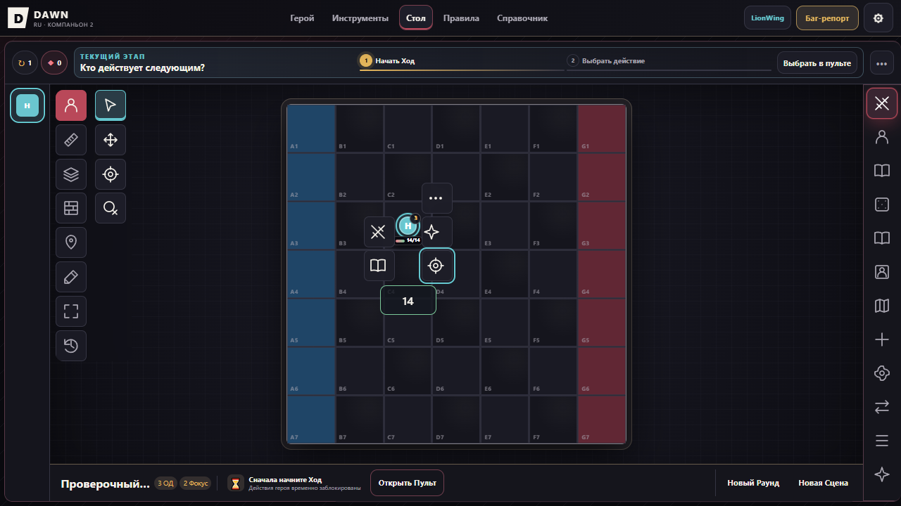
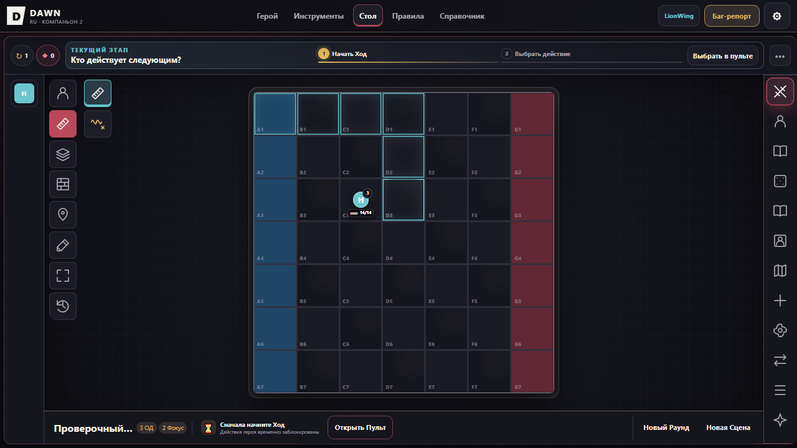
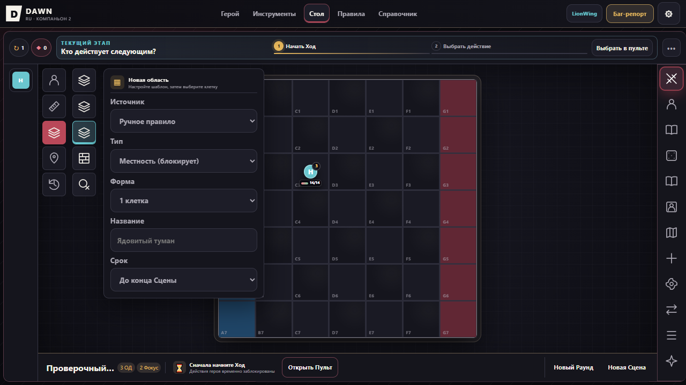
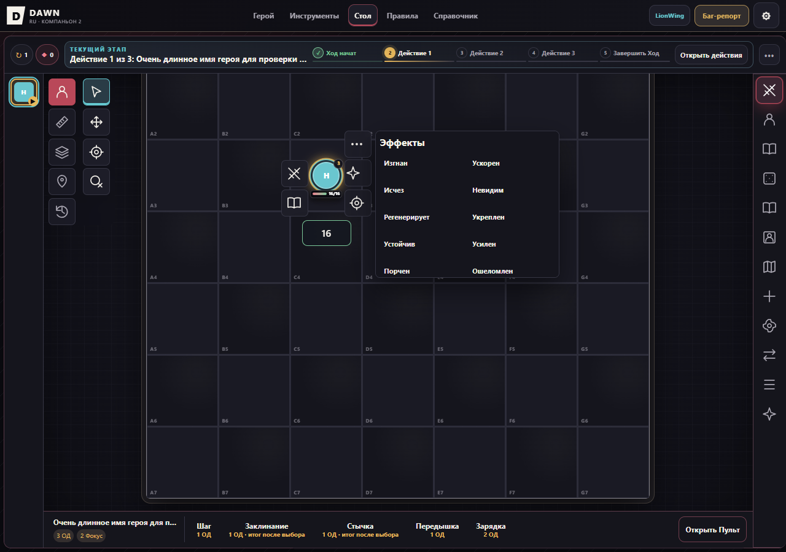
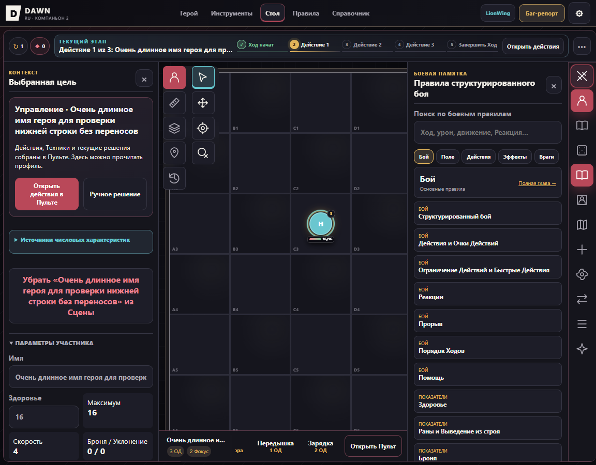
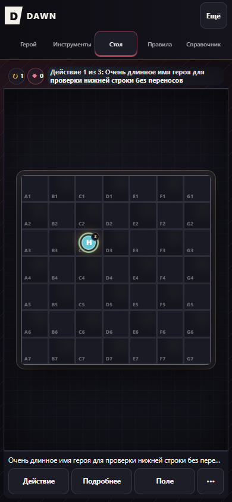
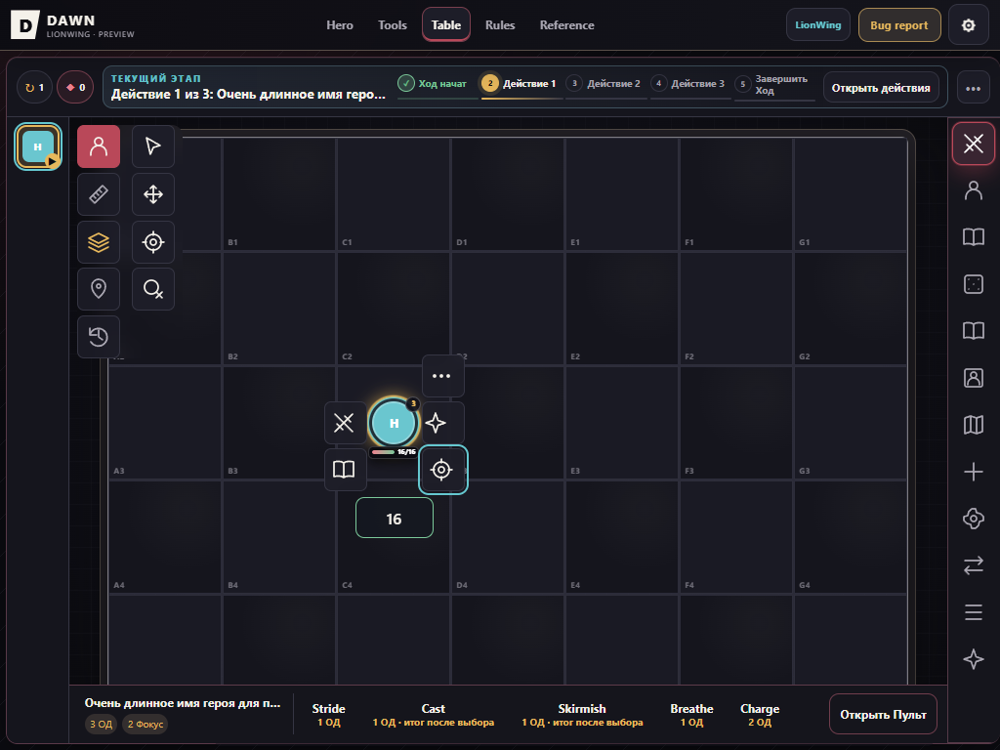

# Продолжение стола · 07.10.2026

Ветка: `codex/table-tools-continuation-20261007`.
База: `origin/codex/table-tools-rework-20261007`, `58b2d2b`.
Первый пакет: `aee944c`. Этот журнал описывает также следующий пакет.
Основной договор: [план](TABLE_TOOLS_PLAN_2026-10-07.md).

## Что сделано

- Линейка — отдельное локальное состояние, не меняющее инструмент Нарратора,
  цели, ресурсы и pending flow. Число возле конечной клетки, Manhattan-дистанция;
  первый клик задаёт начало, наведение показывает длину, второй фиксирует её.
  Escape закрывает измерение раньше отмены игровой подготовки. M включает линейку;
  V/P/T/A/K и W корректно выходят из неё. W не вмешивается в pending destination. Открытый app dialog блокирует
  горячие клавиши инструментов, поэтому настройки не меняют скрытый стол.
- Параметры местности, стен и маркеров находятся возле двухуровневой палитры.
  Выбор инструмента в новой версии не открывает правый редактор карты.
  Окружение содержит одну кнопку области, стену и ограниченный ластик;
  тип области выбирается в форме. Топология убрана из обычных категорий.
  Специальная механика и скрытые legacy nodes сохранены.
- Ластик выбирает конкретную стену/маркер либо верхнюю область и подписывает
  hover. Токен поверх области не превращается в цель удаления. Проверяются
  GM-права и текущая цепочка правил. Backing destroy остаётся rules-aware.
- Стена имеет предпросмотр сегмента, который поворачивается при колесе
  и изменении селектора даже без движения мыши. Новая версия не рисует второй
  legacy preview. Уход с поля удаляет ghost и последнюю точку hover.
- «Вписать» — разовая команда в подробной карте. Открытие/закрытие панели
  и обычный resize больше не запускают повторное автоматическое вписывание.
  Первичное вписывание нового viewport сохранено.
- Рабочие панели справа по умолчанию; левая сторона требует явного opt-in,
  включая прежние split-настройки. Инициатива сохраняет собственное место.
- HUD располагает 44px кнопки и поле ЗД вокруг токена с зазором минимум 6px.
  Если безопасного периметра нет, используется внешняя компактная панель.
  Состав зависит от типа токена и роли; права повторно проверяются в обработчике.
  На телефоне и узком landscape HUD отключён.
- Нижняя строка desktop имеет высоту 60px: имя/ресурсы компактным блоком,
  действия отдельной горизонтальной прокруткой. Обычное колесо над действиями
  прокручивает их, а не поле. Название/полная цена остаются в кнопке,
  подробная причина блокировки — в title. Длинное имя обрезается с полным title.
  Раунд/Сцена перенесены в верхнее «⋯» и вызывают прежние проверенные маршруты
  с повторной проверкой роли и подтверждением окончания боя.
- Исправлена мобильная высота: использовалась старая оценка шапки ~52px,
  хотя реальная шапка 101px. Теперь один владелец --mobile-header-height;
  нижняя панель помещается в viewport, не уходит под нижнюю кромку.
- Переключение classic/next сохраняет реальные DOM controls и их listeners,
  значения форм и данные игры. Новая версия остаётся тестовой и включённой
  по умолчанию согласно прежнему поручению пользователя.

## Реализация и проверка по критериям

| ID | Реализовано | Проверено / предел доказательства |
|---|---|---|
| U01/U10/U14 | Upstream патчи сохранены | Общая регрессия + локальный браузер; дополнительного production-прохода нет |
| U02 | Нейтральное измерение + видимое число | Реальные функции: 0/2/5, GM/Player, pending и Escape; браузер A1→D3 показывает 5 кл. |
| U03 | Нет transport показа/пинга | Не считать выполненным |
| U04 | Прямой выбор/параметры/существующий click-preview | Новый drag gesture и один undo для него НЕ реализованы |
| U05 | Preview/wheel/селектор/cleanup | Реальный mouse-wheel: side-south совпал с ghost, legacy preview=0, walls=0; VM проверяет всю серию wheel/trackpad |
| U06 | Ограниченный ластик + название hover | Браузер удалил область под токеном, сохранил участника и ЗД 16 / ОД 3; VM проверяет права, pending и перекрытия |
| U07 | Параметры маркера доступны в палитре | Полный move/delete/preview и manual-семантика ещё не приняты |
| U08 | Убрана обычная категория topology | Сохранён hidden legacy маршрут; полный набор правил прошёл, отдельной браузерной приёмки Фанатика нет |
| U09 | Нет resize-autofit; Fit разовый | Браузер: zoom 180%, scroll 200/100 сохранены при панели/resize; не весь геометрический набор |
| U11 | Периметр / внешняя панель | 324 случая размера/края/zoom: 315 безопасных раскладок, 9 fallback; браузер desktop/tablet/status list. Fallback не равен полной проверке каждого DOM rect |
| U12 | Role/type-aware HUD | VM права/повторные проверки/ЗД/повтор сетевого запроса; браузер свой Player без HP input и GM-команд. Manual часть остаётся открытой |
| U13 | Левые панели default-off | VM old split opt-in; браузер отдельное включение и две панели |
| U15 | Однорядный footer 60px | Браузер 1152px: обе панели открыты, actions width 203.5 / scrollWidth 529, последняя кнопка полностью видна; authority/confirm/wheel tests. Manual части нет |
| U16 | Существующая история сохранена | Полная регрессия; новый drag gesture не заявлен, полный browser undo/redo для всех объектов ещё нужен |
| M01–M06 | НЕ реализованы | Локальный старый manual НЕ является общей политикой и не отключает правила |
| N01–N03 | НЕ реализованы | Нет доказательств local Realtime/RLS или 5 игр × 5 клиентов |

## Проверки

Команда из корня: `npm --prefix apps/companion test`.
После добавления новых source references: `node apps/companion/tests/lionwing-enemy-inventory.mjs --write`.
Тестовый инвентарь обновлён, чтобы свежий clone не падал на устаревших ссылках.

Первый пакет aee944c: полный npm test, exit 0.
Пакет footer/mobile до финальных shortcuts: полный npm test, exit 0.
Финальный повтор после shortcuts: полный npm test, exit 0.
После последнего dialog guard: полный npm test на a7aa445, exit 0.
Передача: [draft PR №9](https://github.com/Noty-chan/dawn-ru/pull/9).
При остатке 10% пятичасового лимита работа остановлена; временные browser/server закрыты.
Browser dialog guard: при открытых настройках реальные M/W/A/K/P/T
оставили Scene.tool=select и sceneNeutralTool=null; диалог остался открыт.
Точечные scene-pointer-routing и scene-board-wheel после последних правок: PASS.
Добавлены meaningful тесты measurement, eraser и action tray; расширены HUD,
workspace, pointer routing, wheel и palette. В lifecycle fixture добавлен
isEnglishPreview mock; production правила этим не изменяются.

Браузер: одноразовый origin `http://127.0.0.1:8783`, локальная синтетическая
сцена, отдельная Playwright session; пользовательская вкладка не тронута.
Viewport: 1280×900, 1152×900, 1024×768, 390×844.
Для повторения браузерной проверки сначала открыть пустую вкладку Playwright,
установить route `**/*.supabase.co/**` с status 503 и только затем открыть
локальную страницу. Это предотвращает первоначальный anonymous auth.
В этом проходе Supabase запросы блокировались route=503 после первого запуска страницы;
автоматическая anonymous auth успела выполниться до установки блока.
Не подключались к общему столу, не загружали/правили чужие сцены. Ошибки 503
в console ожидаемые; этот проход не подтверждает production сеть.

## Скриншоты

## Задача по вычитке

[Все предложения RU/EN на проверку](COMPANION_LOCALE_COPY_REVIEW_2026-10-07.md).
Старый незакоммиченный переводной patch сохранён локально в ignored output,
не применён поверх свежей ветки. Пользователь просил сначала принести весь
список. D6, формулы, имена и бренды не заменены. Новые подписи функций имеют
RU/EN варианты; существующий интерфейс EN ещё содержит RU утечки.

## Продолжать отсюда

1. Не объединять частичный пакет с main как завершение всего договора.
2. Shared manual policy и allowlist: одна Scene, авторитетная проверка перед
   командами, явная миграция обратно к правилам без лечения/очистки. Старый
   controlMode=manual и prepareDestroy/correct/placement не безопасная основа.
3. Единый input router. Проверить остальные присваивания Scene.tool внутри
   applySceneTemplate, подготовки действий и специальных workflow относительно
   sceneNeutralTool: после измерения переход к destination должен быть явным,
   без отмены подготовки или невидимого активного инструмента.
4. U04: завершённые mouse gestures с preview и одной записью undo; U07:
   справочные маркеры и перемещение, затем настоящий manual writer.
5. Защищённый временный transport U03/N01–N03: публичный epoch/координаты,
   серверные цвета, sender auth/RLS; не переносить скрытые actor IDs.
6. Приёмка true local Realtime/RLS и 5×5, затем main + опубликованный сайт.
7. Продолжить оставшуюся вычитку; простые подписи НПС/Стресса/часов пользователь уже разрешил применять; не утверждать clean RU/EN
   по тому, что новые кнопки переведены.

Внешние пользовательские untracked attachments/output/maps сохранять.
Игнорируемые test logs и local fixtures не нужны для запуска npm test.

## Актуализация передачи после малых переводных пакетов

Первый переводной пакет: d0d6959 (НПС/Стресс). Следующий коммит в этой же ветке переводит редактор часов и актуализирует передачу. Полный npm test относится к a7aa445, новые малые текстовые пакеты проверены точечно, включая реальное выполнение функций в VM; браузер для них не запускался. Все результаты находятся в draft PR №9. Начинать с remote HEAD ветки продолжения, а не с 58b2d2b. Скриншоты относятся к проверке интерфейса стола до текстовых пакетов. Не применять старый LOCAL_DRAFT.patch: он не нужен и может затереть новые строки.

## Продолжение после восстановления лимита

Завершён основной список простых RU/EN исправлений исходной вычитки:
итоги/история/пул/Связи, пустое поле, профили и части босса, доступные подписи
настроек. Полный npm test прошёл после изменений production; дополнительный
тест сохранности tag values затем выполнен отдельно и также прошёл.
[Актуальная таблица применённого и остатка](COMPANION_LOCALE_COPY_REVIEW_2026-10-07.md).
Browser проверялся на отдельном localhost, Supabase route=503 установлен до
первого открытия приложения; пользовательские столы не использованы.
Новые screenshots locale-*.png сохранены в Git рядом с другими материалами.

Следующая задача по языку: обход оставшихся динамических экранов, legacy
данные Связей. Потеря метаданных diceHistory исправлена отдельным пакетом ниже. Они не
подменяют большую следующую задачу shared manual policy из основного плана.

## Сохранение истории бросков

Языковой пакет сохранён коммитом 5202d8d. Следующий пакет исправляет
потерю автора, формулы и граней кубиков при загрузке листа. Нормализатор
сохраняет также пороги подсветки, оплату и отметку состязания; явный target=null
не превращается в цель испытания. Новые записи реально записывают пороги и
ID состязания. Только разрешённые поля, максимум 20 записей и 300 кубиков;
невалидные строки/грани отбрасываются. Уже утраченные старые данные не восстанавливаются.

hero-dice-history.mjs использует production normalizeHero и проверяет
экспорт/импорт, повторную загрузку, старые листы и повреждённые входные данные.
В отдельном localhost браузере настоящий бросок кнопкой сохранил автора
History QA Имя, 4D6 ≥4 и [2,6,1,4,5] после reload. Supabase заблокирован.
Большая следующая задача остаётся shared manual policy; она этим не реализована.

Приёмка последнего пакета: полный npm --prefix apps/companion test завершён с exit 0. S00-INVENTORY обновлён только для ссылки на новый тест. Все 20 локальных ссылок четырёх документов передачи проверены.

## Полный охват по уточнению пользователя

Пользователь попросил довести весь список, подозревая неполный поиск. Ветки и GitHub сверены: новых remote commits нет. Найден и объединён [полный октябрьский backlog](COMPANION_COMPLETE_BACKLOG_2026-10-07.md): U/M/N, UI-01–UI-10, 25 находок трёх аудитов, дополнительные проверки. Следующее выполнение не ограничивать одной локализацией или только U/M/N. Подтверждены открытые P1 tools-flow-03/04/05 и история последствий -06 в текущем play-ui/app-play-events.
